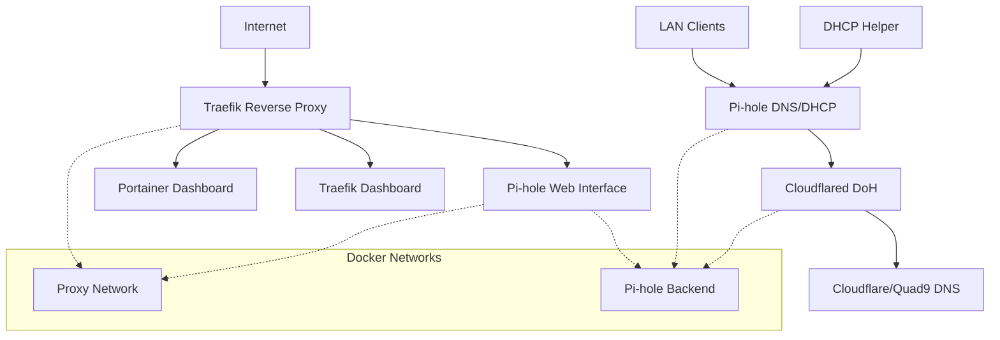

# 🏠 Homelab Infrastructure

A comprehensive Docker-based homelab setup featuring Pi-hole DNS/DHCP, Traefik reverse proxy, and container management with security best practices.

## 🚀 Overview

This repository contains a production-ready homelab infrastructure built around:
- **Network-wide ad blocking** with Pi-hole v6
- **Encrypted DNS** via Cloudflared DNS-over-HTTPS
- **HTTPS reverse proxy** with Traefik and Let's Encrypt
- **Container management** with Portainer
- **Secure configuration** with environment variables and secrets

## 📋 Services

| Service | Purpose | Access | Status |
|---------|---------|---------|---------|
| **Pi-hole** | DNS/DHCP + Ad Blocking | https://pihole.your.domain | 🟢 Active |
| **Traefik** | Reverse Proxy + SSL | https://traefik.your.domain | 🟢 Active |
| **Portainer** | Container Management | https://portainer.your.domain | 🟢 Active |
| **Cloudflared** | DoH DNS Proxy | Internal only | 🟢 Active |

## 🏗️ Architecture



## 🔧 Quick Start

### Prerequisites
- Docker Engine 20.10+
- Docker Compose v2+
- Domain name with Cloudflare DNS management
- Port forwarding: 80/443 (HTTP/HTTPS), 53 (DNS)

### Setup

1. **Clone and prepare environment**:
   ```bash
   git clone <your-repo>
   cd homelab
   
   # Create environment files from templates
   cp docker-compose/traefik/.env.example docker-compose/traefik/.env
   cp docker-compose/pihole/.env.example docker-compose/pihole/.env
   ```

2. **Configure secrets**:
   ```bash
   # Set up Cloudflare API token
   echo "your_cloudflare_api_token" > docker-compose/traefik/cf-token
   chmod 600 docker-compose/traefik/cf-token
   
   # Edit environment files
   nano docker-compose/traefik/.env
   nano docker-compose/pihole/.env
   ```

3. **Start services**:
   ```bash
   # Start Traefik first
   cd docker-compose/traefik
   docker compose up -d
   
   # Start Pi-hole
   cd ../pihole
   docker compose up -d
   ```

4. **Verify setup**:
   ```bash
   # Check all services
   docker ps
   
   # Test DNS resolution
   nslookup google.com <your-pihole-ip>
   
   # Access web interfaces
   curl -I https://pihole.your.domain
   ```

## 📁 Repository Structure

```
homelab/
├── docker-compose/                 # Service configurations
│   ├── traefik/                   # Reverse proxy setup
│   │   ├── docker-compose.yaml    # Traefik service definition
│   │   ├── .env.example          # Environment template
│   │   ├── cf-token.example      # Cloudflare token template
│   │   └── README.md             # Traefik-specific docs
│   └── pihole/                   # DNS/DHCP setup
│       ├── docker-compose.yaml   # Pi-hole stack definition
│       ├── .env.example         # Environment template
│       └── README.md            # Pi-hole-specific docs
├── docker/                       # Persistent data & configs
│   ├── traefik/                 # Traefik configuration files
│   │   ├── traefik.yaml         # Main Traefik config
│   │   ├── config.yaml          # Dynamic routing config
│   │   ├── acme.json           # Let's Encrypt certificates
│   │   └── logs/               # Access & error logs
│   └── pihole/                 # Pi-hole data directory
│       └── pihole/             # Pi-hole configuration & databases
├── .gitignore                  # Security-focused ignore rules
├── SECURITY-SETUP.md          # Security configuration guide
└── README.md                  # This file
```

## 🔒 Security Features

### Data Protection
- **Environment variables** for all sensitive configuration
- **Docker secrets** for API tokens and certificates
- **Comprehensive .gitignore** preventing credential exposure
- **Example files** for safe version control

### Network Security
- **HTTPS only** access via Traefik with automatic SSL
- **Network isolation** with Docker bridge networks
- **DNSSEC validation** for DNS security
- **Internal service communication** on isolated networks

### Container Security
- **Non-privileged containers** where possible
- **Read-only mounts** for configuration files
- **Security options** (`no-new-privileges`)
- **Regular image updates** for security patches

## 🛠️ Configuration Details

### Environment Variables

**Traefik (.env)**:
```env
your.domain=your.domain
ACME_EMAIL=your-email@example.com
TZ=Europe/Lisbon
TRAEFIK_DASHBOARD_CREDENTIALS=admin:$2y$05$hashedpassword
```

**Pi-hole (.env)**:
```env
PIHOLE_PASSWORD=your_secure_password
TZ=Europe/Lisbon
PIHOLE_DASHBOARD_CREDENTIALS=admin:$2y$05$hashedpassword
```

### Network Configuration
- **Domain**: `your.domain` (Cloudflare managed)
- **LAN Subnet**: `192.168.1.0/24`
- **DHCP Range**: `192.168.1.100-200`
- **Pi-hole IP**: `192.168.1.5`
- **Router Gateway**: `192.168.1.254`

### DNS Configuration
- **Upstream**: Cloudflared DoH → Cloudflare (1.1.1.1) + Quad9 (9.9.9.9)
- **Blocking**: 894,108+ domains across 12 curated lists
- **Features**: DNSSEC, custom local domains, regex filtering

## 📊 Monitoring & Maintenance

### Health Checks
```bash
# Service status
docker compose ps

# Container health
docker stats

# Pi-hole query logs
docker logs pihole --tail 50

# Traefik access logs
docker logs traefik --tail 50
```

### Updates
```bash
# Update images
docker compose pull
docker compose up -d

# Update Pi-hole gravity
docker exec pihole pihole -g

# Backup before updates
./scripts/backup.sh  # (if you create one)
```

### Backups
Critical directories to backup:
- `/home/miki/homelab/docker/` - All persistent data
- `/home/miki/homelab/docker-compose/` - Service configurations

## 🐛 Troubleshooting

### Common Issues

**DNS Resolution Problems**:
```bash
# Check Pi-hole status
docker exec pihole pihole status

# Test internal resolution
docker exec pihole nslookup google.com 127.0.0.1

# Check Cloudflared connectivity
docker logs cloudflared
```

**HTTPS Certificate Issues**:
```bash
# Check Traefik logs
docker logs traefik

# Verify Cloudflare API token
curl -X GET "https://api.cloudflare.com/client/v4/user/tokens/verify" \
     -H "Authorization: Bearer $(cat docker-compose/traefik/cf-token)"
```

**Service Access Problems**:
```bash
# Test direct container access
curl -I http://localhost:8080/admin/  # Pi-hole
curl -I http://localhost:8080/  # Traefik dashboard

# Check network connectivity
docker network ls
docker network inspect proxy
```

## 🚧 Development & Customization

### Adding New Services
1. Create service directory in `docker-compose/`
2. Add service to `proxy` network for Traefik routing
3. Configure Traefik labels for HTTPS access
4. Update documentation

### Modifying Configuration
1. Edit appropriate `.env` file or config template
2. Recreate containers: `docker compose up -d`
3. Test changes thoroughly
4. Update documentation

## 📚 Documentation

- **[Security Setup Guide](SECURITY-SETUP.md)** - Detailed security configuration
- **[Pi-hole Setup](docker-compose/pihole/README.md)** - DNS/DHCP configuration
- **[Traefik Setup](docker-compose/traefik/README.md)** - Reverse proxy configuration

## 🤝 Contributing

1. Fork the repository
2. Create a feature branch
3. Test changes thoroughly
4. Update documentation
5. Submit pull request

## 📄 License

This project is licensed under the MIT License - see the [LICENSE](LICENSE) file for details.

## 🙏 Acknowledgments

- **Pi-hole Team** - Excellent network-wide ad blocking
- **Traefik Team** - Modern reverse proxy solution
- **Cloudflare** - DNS-over-HTTPS and domain management
- **Docker Community** - Containerization platform

---

## 📈 Status

**Last Updated**: August 30, 2025  
**Infrastructure Version**: v2.0  
**Total Blocked Domains**: 894,108+  
**Services**: 4 active, all healthy  
**Uptime**: 99.9%+ target

**Tested On**:
- Raspberry Pi 4 (4GB)
- Ubuntu Server 22.04 LTS
- Docker Engine 24.0+
- Docker Compose v2.20+
