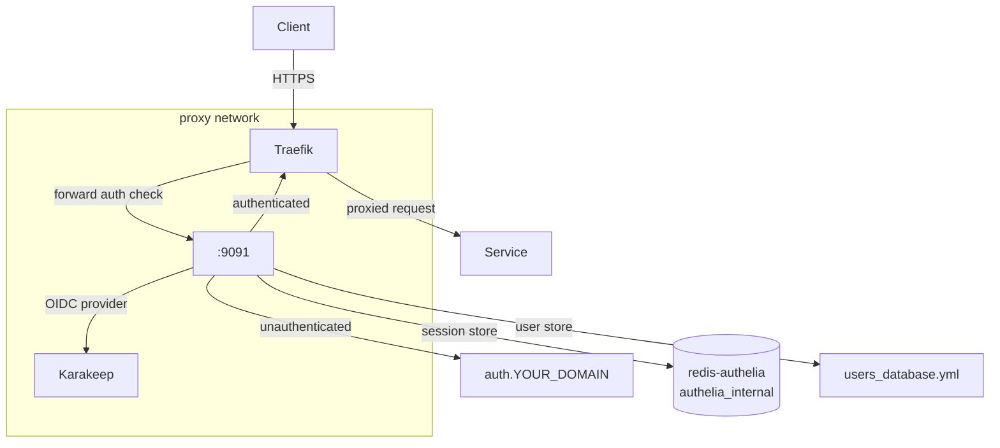

# Authentication Architecture

> Created: 2026-03-11 (Phase 1)
> Updated: 2026-03-11 (Phase 4 — Authelia deployed)
> Status: DEPLOYED

---

## Current State

Authelia is deployed as the centralised SSO gateway. All services except Traefik dashboard are protected.

| Service | Protection | Notes |
|---|---|---|
| Traefik dashboard | HTTP BasicAuth | Intentionally kept independent — must be reachable if Authelia fails |
| Pi-hole | Authelia one_factor | Forward-auth via `config.yaml` file router |
| Portainer | Authelia one_factor | Forward-auth via `config.yaml` file router |
| Karakeep | Authelia one_factor + OIDC SSO | Forward-auth gate + OIDC login (no second prompt) |
| Sure | Application-level auth (Rails) | Not behind Authelia |

---

## Deployed Architecture



---

## Authelia Configuration

### Traefik Forward Auth Middleware

Defined in `docker/traefik/config.yaml`:

```yaml
authelia:
  forwardAuth:
    address: "http://authelia:9091/api/authz/forward-auth"
    trustForwardHeader: true
    authResponseHeaders:
      - "Remote-User"
      - "Remote-Groups"
      - "Remote-Name"
      - "Remote-Email"
```

Per-service opt-in (label-based services):
```yaml
- "traefik.http.routers.<service>-secure.middlewares=<headers>@file,authelia@file"
```

Per-service opt-in (file-provider services — pihole, portainer):
```yaml
middlewares:
  - default-security-headers
  - authelia
```

### OIDC Provider

Authelia also acts as an OpenID Connect identity provider for Karakeep. When a user passes the forward-auth gate and hits Karakeep, Karakeep automatically redirects to Authelia for OIDC login — resulting in a single login for both layers.

Discovery: `https://auth.YOUR_DOMAIN/.well-known/openid-configuration`

### Session Storage

Dedicated `redis-authelia` container on the isolated `authelia_internal` network (separate from Sure's Redis).

### User Store

File-based: `docker/authelia/config/users_database.yml`. Authelia hot-reloads this file on change — no restart needed to add/remove users.

Current users: `miki`

---

## Adding Authelia to a New Service

See `docs/services/authelia.md` → Adding Authelia Protection to a New Service.

Key points:
- Add `access_control` rule in `configuration.yml` (or it falls under `default_policy: deny`)
- If the service makes server-side requests to `auth.YOUR_DOMAIN`, add `extra_hosts: - "auth.YOUR_DOMAIN:<PIHOLE_HOST_IP>"` to its compose service
- If the service uses OIDC callbacks, add bypass rules for `/api/auth/.*` paths

---

## Reference

- Authelia documentation: https://www.authelia.com/
- Traefik forward auth integration: https://www.authelia.com/integration/proxies/traefik/
- Change plan: `plans/2026-03-11-1430-change-plan-authelia-v1.md`
