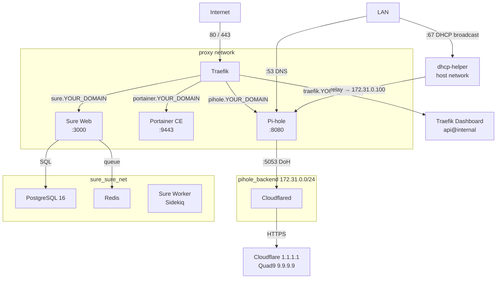

# Homelab Infrastructure

> Created: 2026-03-11 (Phase 0 — Infrastructure Discovery)

---

## Overview

A self-hosted homelab platform running on a Raspberry Pi 4 (aarch64, 7.6 GiB RAM, 115 GiB storage). All services are containerized with Docker Compose. Traefik provides HTTPS reverse proxy with automatic wildcard certificates. Pi-hole provides network-wide DNS filtering and DHCP.

---

## Architecture Diagram

---

## Network Design

### proxy (external bridge)

Created manually: `docker network create proxy`

All services that need HTTPS access via Traefik must join this network. Traefik uses Docker provider autodiscovery over this network.

### pihole_backend (internal bridge)

Auto-created by the pihole compose stack. Subnet `172.31.0.0/24`. Isolates DNS traffic between Pi-hole and Cloudflared. Pi-hole has static IP `172.31.0.100` on this network.

### sure_sure_net (internal bridge)

Auto-created by the sure compose stack. Isolates the Sure application tier (web, worker, db, redis). Only `sure-web-1` is also on the `proxy` network.

---

## Compose File Locations

| Service | Compose file |
|---|---|
| Traefik | `docker-compose/traefik/docker-compose.yaml` |
| Pi-hole | `docker-compose/pihole/docker-compose.yaml` |
| Portainer | `docker-compose/portainer/docker-compose.yaml` |
| Sure | `docker-compose/sure/compose.yml` |

---

## Configuration File Locations

| File | Purpose |
|---|---|
| `docker/traefik/traefik.yaml` | Traefik static config (entrypoints, providers, ACME) |
| `docker/traefik/config.yaml` | Traefik dynamic config (middlewares, file-provider routers) |
| `docker/traefik/acme.json` | Let's Encrypt certificate store (chmod 600, gitignored) |
| `docker/traefik/logs/` | Traefik access and error logs |
| `docker/pihole/pihole/` | Pi-hole runtime data (databases, config) |
| `docker/pihole/etc-dnsmasq.d/` | Custom dnsmasq configuration |
| `docker/portainer/data/` | Portainer persistent state |

---

## Secret Management

| Secret | Location | Method |
|---|---|---|
| Cloudflare API token | `docker-compose/traefik/cf-token` | Docker secret (file), `chmod 600` |
| Traefik dashboard password | `docker-compose/traefik/.env` | Bcrypt hash via `htpasswd -nbB` |
| Pi-hole admin password | `docker-compose/pihole/.env` | Environment variable |
| Sure DB password | `docker-compose/sure/.env` (if present) | Environment variable |

All `.env` files are gitignored. Only `.env.example` files are committed.

---

## Startup Order

Services must be started in this order on a fresh boot or after `docker network create proxy`:

1. `docker-compose/traefik` — establishes the proxy network and TLS
2. `docker-compose/pihole` — DNS/DHCP (depends on proxy existing)
3. `docker-compose/portainer` — container management
4. `docker-compose/sure` — application stack

Docker itself handles restart policies (`unless-stopped`) for subsequent reboots.

---

## Pi-hole Configuration Notes

- Pi-hole v6 uses `FTLCONF_*` environment variables instead of config files.
- Upstream DNS: Cloudflared on port 5053 (`cloudflared#5053`).
- DHCP active: range `<DHCP_RANGE_START>–<DHCP_RANGE_END>`, gateway `<ROUTER_IP>`.
- Pi-hole host IP on LAN: `<PIHOLE_HOST_IP>`.
- DHCP on bridge networks requires the `dhcp-helper` sidecar (host network mode) to relay broadcasts.
- Pi-hole serves CNAME records for all service domains pointing to `apps.YOUR_DOMAIN` → `<PIHOLE_HOST_IP>`.

---

## Traefik Configuration Notes

- Static config: `/docker/traefik/traefik.yaml`
  - Entrypoints: `http` (:80, redirects all to https), `https` (:443)
  - Providers: Docker (autodiscovery via `/var/run/docker.sock`) + file (`config.yaml`)
  - Certificate resolver: `cloudflare` (DNS challenge, Let's Encrypt)
  - `insecureSkipVerify: true` on serversTransport (allows Traefik → Portainer self-signed cert)
- Dynamic config: `/docker/traefik/config.yaml`
  - Defines shared security header middlewares
  - Defines static file-provider routers for Portainer and Pi-hole using host IPs
- Docker label routing: used by Traefik, Sure (and duplicated for Portainer/Pi-hole)
