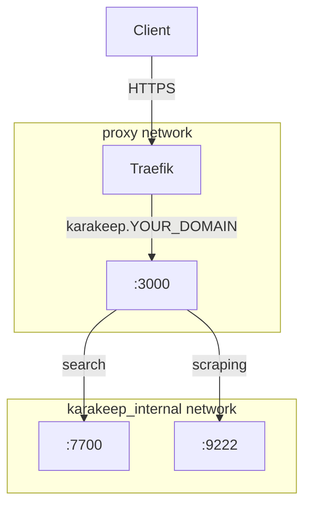

# Change Plan: Karakeep Deployment — v1

**Date**: 2026-03-11
**Phase**: 2 (Architecture) → 3 (Deployment)
**Status**: DEPLOYED — 2026-03-11

**Deployment notes (issues resolved during deploy):**
- `ghcr.io/browserless/chrome:latest` has no ARM64 manifest → replaced with `ghcr.io/browserless/chromium:latest`
- Meilisearch healthcheck used `localhost` → resolved to IPv6 on ARM64; fixed to `127.0.0.1`
- `BROWSER_WEB_URL` port was `9222` → Browserless Chromium listens on `3000`
- Browserless v2 reports `ws://0.0.0.0` in CDP response → fixed with `HOST: "chrome"` env var
- WebSocket auth 401 → Browserless requires token in WebSocket URL; switched to `BROWSER_WEBSOCKET_URL=ws://chrome:3000/chromium/playwright?token=...`

---

## Overview

Deploy Karakeep — a self-hosted "bookmark-everything" application — as a three-container stack on the existing Raspberry Pi homelab. Karakeep will be accessible at `karakeep.YOUR_DOMAIN` via Traefik with HTTPS and a wildcard Let's Encrypt certificate.

The stack consists of:
- **karakeep** — main application (Next.js, Node.js, SQLite, integrated workers)
- **meilisearch** — full-text search engine (internal only)
- **chrome** — headless Chromium for web scraping and screenshots (internal only)

No existing services are modified.

---

## Architecture



Only the `karakeep` container joins the `proxy` network. Meilisearch and Chrome are isolated on the internal `karakeep_internal` network and have no external exposure.

---

## Proposed Changes

1. Create directory `~/homelab/docker-compose/karakeep/`
2. Create `docker-compose.yaml` for the karakeep stack
3. Create `.env.example` for the karakeep stack
4. Create data directories under `~/homelab/docker/karakeep/`
5. Add `karakeep.YOUR_DOMAIN` CNAME to Pi-hole DNS config
6. Create `.env` from `.env.example` and populate secrets
7. Run linting checks (Phase 3 gate)
8. Deploy (Phase 3)

---

## Configuration Preview

### `docker-compose/karakeep/docker-compose.yaml`

```yaml
services:
  karakeep:
    image: ghcr.io/karakeep-app/karakeep:release
    container_name: karakeep
    restart: unless-stopped
    security_opt:
      - no-new-privileges:true

    networks:
      - proxy
      - karakeep_internal

    volumes:
      - ~/homelab/docker/karakeep/data:/data

    env_file:
      - .env

    environment:
      MEILI_ADDR: "http://meilisearch:7700"
      BROWSER_WEB_URL: "http://chrome:3000?token=${CHROME_TOKEN}"
      DATA_DIR: "/data"
      MEILI_NO_ANALYTICS: "true"

    depends_on:
      meilisearch:
        condition: service_healthy
      chrome:
        condition: service_started

    labels:
      - "traefik.enable=true"
      - "traefik.docker.network=proxy"

      # HTTP → HTTPS redirect
      - "traefik.http.routers.karakeep.entrypoints=http"
      - "traefik.http.routers.karakeep.rule=Host(`karakeep.${DOMAIN_NAME}`)"
      - "traefik.http.routers.karakeep.middlewares=https-redirectscheme@file"

      # HTTPS router
      - "traefik.http.routers.karakeep-secure.entrypoints=https"
      - "traefik.http.routers.karakeep-secure.rule=Host(`karakeep.${DOMAIN_NAME}`)"
      - "traefik.http.routers.karakeep-secure.tls=true"
      - "traefik.http.routers.karakeep-secure.tls.certresolver=cloudflare"
      - "traefik.http.routers.karakeep-secure.service=karakeep"
      # To add Authelia (once deployed): append ",authelia@file" to this value
      - "traefik.http.routers.karakeep-secure.middlewares=karakeep-security-headers@file"

      # Backend
      - "traefik.http.services.karakeep.loadbalancer.server.port=3000"

  meilisearch:
    image: getmeili/meilisearch:v1.12
    container_name: meilisearch
    restart: unless-stopped
    security_opt:
      - no-new-privileges:true

    networks:
      - karakeep_internal

    volumes:
      - ~/homelab/docker/karakeep/meilisearch:/meili_data

    environment:
      MEILI_MASTER_KEY: "${MEILI_MASTER_KEY}"
      MEILI_NO_ANALYTICS: "true"

    healthcheck:
      test: ["CMD", "wget", "-qO-", "http://127.0.0.1:7700/health"]
      interval: 30s
      timeout: 10s
      retries: 5

  chrome:
    image: ghcr.io/browserless/chromium:latest  # chromium has ARM64 support; chrome is amd64-only
    container_name: karakeep-chrome
    restart: unless-stopped
    security_opt:
      - no-new-privileges:true

    networks:
      - karakeep_internal

    environment:
      TIMEOUT: "60000"
      CONCURRENT: "3"
      TOKEN: "${CHROME_TOKEN}"

networks:
  proxy:
    external: true
  karakeep_internal:
    driver: bridge
```

### `docker-compose/karakeep/.env.example`

```env
# Domain
DOMAIN_NAME=YOUR_DOMAIN

# Timezone
TZ=Europe/Lisbon

# Karakeep auth — generate with: openssl rand -base64 36
NEXTAUTH_SECRET=replace_with_random_secret
NEXTAUTH_URL=https://karakeep.YOUR_DOMAIN

# Meilisearch — generate with: openssl rand -base64 36
MEILI_MASTER_KEY=replace_with_random_secret

# Chrome browser token — generate with: openssl rand -hex 16
CHROME_TOKEN=replace_with_random_token

# Optional: OpenAI GPT-4.1 for AI-powered tagging (disabled on initial deploy)
# Enable later — see docs/services/karakeep.md → AI Tagging
# OPENAI_API_KEY=sk-...
# INFERENCE_TEXT_MODEL=gpt-4.1
# INFERENCE_IMAGE_MODEL=gpt-4.1
# INFERENCE_CONTEXT_LENGTH=4096
# INFERENCE_ENABLE_AUTO_SUMMARIZATION=true
```

### Pi-hole DNS change

Add to `FTLCONF_dns_cnameRecords` in `docker-compose/pihole/docker-compose.yaml`:

```
karakeep.${DOMAIN_NAME},apps.${DOMAIN_NAME}
```

The full updated value becomes:
```
sure.${DOMAIN_NAME},apps.${DOMAIN_NAME};traefik.${DOMAIN_NAME},apps.${DOMAIN_NAME};pihole.${DOMAIN_NAME},apps.${DOMAIN_NAME};portainer.${DOMAIN_NAME},apps.${DOMAIN_NAME};karakeep.${DOMAIN_NAME},apps.${DOMAIN_NAME}
```

After updating, recreate the pihole container:
```bash
cd ~/homelab/docker-compose/pihole && docker compose up -d --force-recreate pihole
```

---

## Linting Checklist (Phase 3 gate — must pass before deployment)

```
[ ] docker compose config                    # YAML syntax + env resolution
[ ] docker network inspect proxy             # proxy network exists
[ ] docker compose up --no-start             # simulation
[ ] All required env vars present in .env
[ ] .env excluded from git (verify .gitignore)
[ ] No host ports bound (meilisearch :7700 and chrome :9222 must be internal only)
[ ] acme.json permissions: chmod 600
```

---

## Risk Assessment

| Risk | Likelihood | Impact | Mitigation |
|---|---|---|---|
| Chrome container high memory usage | Medium | Medium | Monitor with `docker stats`; limit resources if needed |
| `default-security-headers` CSP blocks Karakeep UI assets | Low | Low | Switch to relaxed middleware if CSP violations appear in browser |
| Meilisearch index corruption on ungraceful stop | Low | Low | Data is rebuildable; Karakeep re-indexes on startup |
| Port 3000 accidentally exposed to host | Low | Medium | Compose file has no `ports:` on karakeep; double-check before deploy |
| NEXTAUTH_SECRET not set | Low | High | Karakeep will refuse to start if missing; caught by `docker compose config` |
| Pi-hole CNAME update causes brief DNS hiccup | Very Low | Very Low | Container recreate is fast (<5s); DNS TTL is short for local Pi-hole |
| ARM64 image unavailable | Very Low | High | `ghcr.io/karakeep-app/karakeep:release` is a multi-arch manifest including `linux/arm64` — confirmed available |

---

## Rollback Plan

### If deployment fails or service is unhealthy:

```bash
# 1. Stop and remove karakeep stack
cd ~/homelab/docker-compose/karakeep
docker compose down

# 2. Remove data directories (if desired — only if clean start is preferred)
# CAUTION: this deletes all bookmarks
# rm -rf ~/homelab/docker/karakeep/

# 3. Revert Pi-hole CNAME (remove karakeep entry from FTLCONF_dns_cnameRecords)
cd ~/homelab/docker-compose/pihole
# Edit docker-compose.yaml, remove karakeep CNAME entry
docker compose up -d --force-recreate pihole

# 4. Verify other services are unaffected
docker ps
curl -sI https://traefik.YOUR_DOMAIN | head -1
curl -sI https://pihole.YOUR_DOMAIN  | head -1
```

No existing services are touched during this deployment, so rollback impact is isolated to the karakeep stack.

---

## Post-Deployment Verification

```bash
# Container health
docker ps --filter "name=karakeep"
docker ps --filter "name=meilisearch"
docker ps --filter "name=karakeep-chrome"

# Logs
docker logs karakeep --tail 30
docker logs meilisearch --tail 20

# HTTPS access
curl -sI https://karakeep.YOUR_DOMAIN | head -5

# DNS resolution
nslookup karakeep.YOUR_DOMAIN <PIHOLE_HOST_IP>

# Traefik routing
docker logs traefik --tail 20 | grep karakeep
```

---

## Open Decisions

1. ~~**AI features**~~ — **RESOLVED**: Skip AI tagging on initial deployment. Will enable OpenAI GPT-4.1 later. See `docs/services/karakeep.md` → AI Tagging section for the exact enable procedure.
2. ~~**Chrome token**~~ — **RESOLVED**: Use token-authenticated Chrome. `CHROME_TOKEN` is already in `.env.example`; generate with `openssl rand -hex 16`.
3. ~~**CSP**~~ — **RESOLVED**: `karakeep-security-headers` (relaxed CSP, no `contentSecurityPolicy` directive) added to `docker/traefik/config.yaml`. Karakeep label uses `karakeep-security-headers@file`. Traefik picks this up live — no restart needed.
4. ~~**Authelia**~~ — **RESOLVED**: Deploy Karakeep now without SSO. Authelia middleware will be added to the Karakeep router as part of Phase 4.

---

## Files to Create (Phase 3)

```
docker-compose/karakeep/
  docker-compose.yaml
  .env.example          ← commit this
  .env                  ← gitignored, must be created manually

docker/karakeep/
  data/                 ← created by Docker on first run
  meilisearch/          ← created by Docker on first run
```
