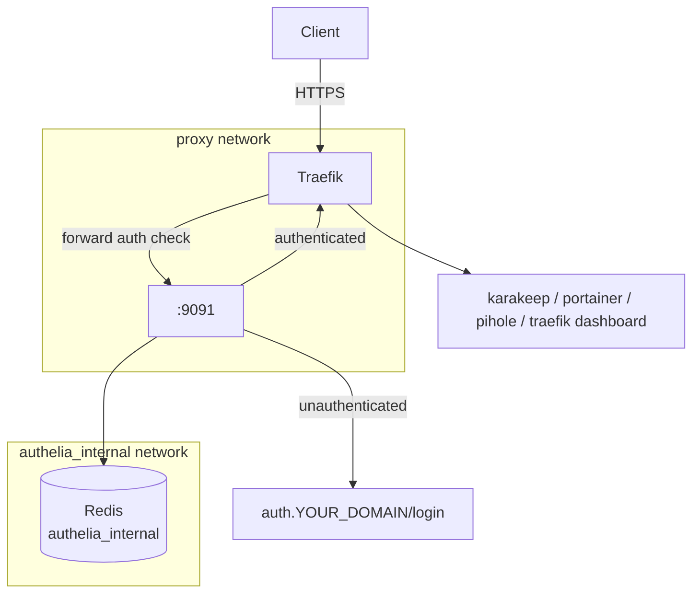

# Change Plan: Authelia Deployment — v1

**Date**: 2026-03-11
**Phase**: 4 — Authelia Deployment
**Status**: DEPLOYED — 2026-03-11

---

## Overview

Deploy Authelia as a forward-auth SSO gateway in front of Traefik. All protected services will require a valid Authelia session before Traefik proxies the request. Authentication uses a file-based user store. Sessions are stored in a dedicated Redis instance.

Two containers: `authelia` + `redis-authelia` (isolated from Sure's Redis).

**Domain**: `auth.YOUR_DOMAIN`

---

## Architecture



---

## Proposed Changes

1. Create `docker-compose/authelia/` and `docker/authelia/config/` and `docker/authelia/data/`
2. Write `docker/authelia/config/configuration.yml`
3. Create `docker/authelia/config/users_database.yml` (user populates password hash)
4. Create `docker-compose/authelia/docker-compose.yaml`
5. Create `docker-compose/authelia/.env.example`
6. Add `authelia` middleware to `docker/traefik/config.yaml`
7. Update Karakeep, Portainer, Pi-hole, and Traefik dashboard routers to use Authelia
8. Add `auth.YOUR_DOMAIN` CNAME to Pi-hole
9. Restart Traefik to reload `config.yaml`
10. Deploy Authelia stack
11. Generate password hash and populate `users_database.yml`

---

## Configuration Preview

### `docker-compose/authelia/docker-compose.yaml`

```yaml
services:
  authelia:
    image: ghcr.io/authelia/authelia:4.38
    container_name: authelia
    restart: unless-stopped
    security_opt:
      - no-new-privileges:true

    networks:
      - proxy
      - authelia_internal

    volumes:
      - ~/homelab/docker/authelia/config:/config
      - ~/homelab/docker/authelia/data:/data

    env_file:
      - .env

    environment:
      TZ: "${TZ}"
      AUTHELIA_SESSION_REDIS_HOST: "redis-authelia"
      AUTHELIA_SESSION_REDIS_PORT: "6379"

    labels:
      - "traefik.enable=true"
      - "traefik.docker.network=proxy"

      # HTTP → HTTPS redirect
      - "traefik.http.routers.authelia.entrypoints=http"
      - "traefik.http.routers.authelia.rule=Host(`auth.${DOMAIN_NAME}`)"
      - "traefik.http.routers.authelia.middlewares=https-redirectscheme@file"

      # HTTPS router — no auth middleware on Authelia itself
      - "traefik.http.routers.authelia-secure.entrypoints=https"
      - "traefik.http.routers.authelia-secure.rule=Host(`auth.${DOMAIN_NAME}`)"
      - "traefik.http.routers.authelia-secure.tls=true"
      - "traefik.http.routers.authelia-secure.tls.certresolver=cloudflare"
      - "traefik.http.routers.authelia-secure.service=authelia"
      - "traefik.http.routers.authelia-secure.middlewares=default-security-headers@file"

      # Backend
      - "traefik.http.services.authelia.loadbalancer.server.port=9091"

  redis-authelia:
    image: redis:7-alpine
    container_name: redis-authelia
    restart: unless-stopped
    security_opt:
      - no-new-privileges:true

    networks:
      - authelia_internal

    volumes:
      - ~/homelab/docker/authelia/redis:/data

    command: >
      redis-server
      --requirepass "${REDIS_PASSWORD}"
      --save 60 1
      --loglevel warning

    healthcheck:
      test: ["CMD", "redis-cli", "-a", "${REDIS_PASSWORD}", "ping"]
      interval: 30s
      timeout: 10s
      retries: 5

networks:
  proxy:
    external: true
  authelia_internal:
    driver: bridge
```

### `docker-compose/authelia/.env.example`

```env
# Domain
DOMAIN_NAME=YOUR_DOMAIN
TZ=Europe/Lisbon

# Authelia secrets — generate each with: openssl rand -base64 64 | tr -d '\n'
AUTHELIA_IDENTITY_VALIDATION_RESET_PASSWORD_JWT_SECRET=replace_with_random_secret
AUTHELIA_SESSION_SECRET=replace_with_random_secret
AUTHELIA_STORAGE_ENCRYPTION_KEY=replace_with_random_secret

# Redis password — generate with: openssl rand -base64 32 | tr -d '\n'
REDIS_PASSWORD=replace_with_random_secret
AUTHELIA_SESSION_REDIS_PASSWORD=replace_with_same_redis_secret
```

### `docker/authelia/config/configuration.yml`

```yaml
server:
  address: 'tcp://:9091'

log:
  level: 'info'

totp:
  issuer: 'YOUR_DOMAIN'
  period: 30
  skew: 1

authentication_backend:
  file:
    path: '/config/users_database.yml'
    password:
      algorithm: argon2id
      argon2:
        iterations: 3
        memory: 65536
        parallelism: 4
        key_length: 32
        salt_length: 16

session:
  cookies:
    - name: 'authelia_session'
      domain: 'YOUR_DOMAIN'
      authelia_url: 'https://auth.YOUR_DOMAIN'
      expiration: '12 hours'
      inactivity: '45 minutes'

storage:
  local:
    path: '/data/db.sqlite3'

notifier:
  filesystem:
    filename: '/data/notification.txt'

access_control:
  default_policy: 'deny'
  rules:
    # Authelia portal itself — always bypass
    - domain: 'auth.YOUR_DOMAIN'
      policy: 'bypass'

    # Protected services — require single-factor auth
    - domain:
        - 'traefik.YOUR_DOMAIN'
        - 'portainer.YOUR_DOMAIN'
        - 'pihole.YOUR_DOMAIN'
        - 'karakeep.YOUR_DOMAIN'
      policy: 'one_factor'
```

### `docker/authelia/config/users_database.yml`

```yaml
users:
  admin:
    displayname: 'Admin'
    # Generate hash: docker run --rm ghcr.io/authelia/authelia:4.38 \
    #   authelia crypto hash generate argon2 --password 'yourpassword'
    password: 'REPLACE_WITH_ARGON2_HASH'
    email: 'your-email@example.com'
    groups:
      - admins
```

### `docker/traefik/config.yaml` additions

Add to the `middlewares:` section:

```yaml
    authelia:
      forwardAuth:
        address: "http://authelia:9091/api/authz/forward-auth"
        trustForwardHeader: true
        authResponseHeaders:
          - "Remote-User"
          - "Remote-Groups"
          - "Remote-Name"
          - "Remote-Email"
```

### Router middleware updates

**Karakeep** (`docker-compose/karakeep/docker-compose.yaml`):
```yaml
# Change from:
- "traefik.http.routers.karakeep-secure.middlewares=karakeep-security-headers@file"
# To:
- "traefik.http.routers.karakeep-secure.middlewares=karakeep-security-headers@file,authelia@file"
```

**Portainer** (`docker-compose/portainer/docker-compose.yaml`):
```yaml
# Change from:
- "traefik.http.routers.portainer-secure.middlewares=portainer-headers"
# To:
- "traefik.http.routers.portainer-secure.middlewares=authelia@file"
```

**Pi-hole** (labels in `docker-compose/pihole/docker-compose.yaml`):
```yaml
# Change from:
- "traefik.http.routers.pihole-secure.middlewares=pihole-addprefix"
# To:
- "traefik.http.routers.pihole-secure.middlewares=pihole-addprefix,authelia@file"
```

**Traefik dashboard** (`docker-compose/traefik/docker-compose.yaml`):
```yaml
# Change from:
- "traefik.http.routers.traefik-secure.middlewares=traefik-auth"
# To:
- "traefik.http.routers.traefik-secure.middlewares=authelia@file"
```

**Pi-hole DNS CNAME** — add to `FTLCONF_dns_cnameRecords`:
```
auth.${DOMAIN_NAME},apps.${DOMAIN_NAME}
```

---

## Pre-Deployment Steps (manual, required before deploy)

### 1. Generate secrets

```bash
# Run each line separately; copy each output into .env
openssl rand -base64 64 | tr -d '\n'  # → AUTHELIA_IDENTITY_VALIDATION_RESET_PASSWORD_JWT_SECRET
openssl rand -base64 64 | tr -d '\n'  # → AUTHELIA_SESSION_SECRET
openssl rand -base64 64 | tr -d '\n'  # → AUTHELIA_STORAGE_ENCRYPTION_KEY
openssl rand -base64 32 | tr -d '\n'  # → REDIS_PASSWORD (and AUTHELIA_SESSION_REDIS_PASSWORD — same value)
```

### 2. Generate password hash for users_database.yml

```bash
docker run --rm ghcr.io/authelia/authelia:4.38 \
  authelia crypto hash generate argon2 --password 'yourpassword'
```

Paste the output (starts with `$argon2id$`) into `users_database.yml`.

### 3. Set your email in users_database.yml

---

## Linting Checklist (gate before deployment)

```
[ ] docker compose config                    # YAML + env resolution
[ ] docker network inspect proxy             # proxy network exists
[ ] docker compose up --no-start             # simulation
[ ] configuration.yml has no placeholder values
[ ] users_database.yml has real argon2 hash (not REPLACE_WITH_ARGON2_HASH)
[ ] REDIS_PASSWORD == AUTHELIA_SESSION_REDIS_PASSWORD in .env
[ ] auth.YOUR_DOMAIN CNAME added to Pi-hole
[ ] Traefik restarted after config.yaml update
```

---

## Risk Assessment

| Risk | Likelihood | Impact | Mitigation |
|---|---|---|---|
| Authelia misconfiguration locks out all services | Medium | High | Keep direct Pi IP access as fallback (e.g. `<PIHOLE_HOST_IP>:9000` for Portainer) |
| `access_control` rule denies Authelia portal itself | Low | High | `auth.YOUR_DOMAIN` has explicit `bypass` rule first |
| Redis password mismatch between services | Low | High | Both vars set from same generated value; caught by linting |
| Karakeep session lost after Authelia redirect | Low | Low | `NEXTAUTH_URL` is set correctly; NextAuth handles redirect back |
| `config.yaml` inode issue (restart needed) | Certain | Medium | Traefik restart is in the deployment steps |
| Argon2 hash computation slow on Pi 4 | Low | Low | 500ms–1s per login is acceptable; only on login, not per-request |

---

## Rollback Plan

```bash
# 1. Revert router middleware labels — remove authelia@file from:
#    docker-compose/karakeep/docker-compose.yaml
#    docker-compose/portainer/docker-compose.yaml
#    docker-compose/pihole/docker-compose.yaml
#    docker-compose/traefik/docker-compose.yaml
#    Then recreate each affected stack

# 2. Remove authelia middleware from config.yaml
#    Then: cd ~/homelab/docker-compose/traefik && docker compose restart traefik

# 3. Stop authelia stack
cd ~/homelab/docker-compose/authelia && docker compose down

# 4. Remove auth.YOUR_DOMAIN CNAME from Pi-hole
#    Recreate pihole: docker compose up -d --force-recreate pihole

# 5. Restore Traefik dashboard BasicAuth label if desired
```

No data is destroyed on rollback. Authelia's SQLite database and Redis data persist in docker/authelia/.

---

## Post-Deployment Verification

```bash
# Container health
docker ps --filter "name=authelia"
docker ps --filter "name=redis-authelia"

# Authelia logs
docker logs authelia --tail 30

# HTTPS access to portal
curl -sI https://auth.YOUR_DOMAIN | head -5

# Test protection: should redirect to auth.YOUR_DOMAIN
curl -sI https://karakeep.YOUR_DOMAIN | grep -i location

# DNS
nslookup auth.YOUR_DOMAIN <PIHOLE_HOST_IP>
```

---

## Pending Subtasks (Phase 4 — to complete before Phase 5)

These tasks were identified during Phase 4 deployment and must be resolved before proceeding to Phase 5 (Watchtower).

---

### Subtask 4.1 — Fix DHCP relay (WiFi connectivity)

**Status**: ✅ RESOLVED — 2026-03-12

**Symptom**: `dnsmasq: no address range available for DHCP request via eth0/eth1` — devices failing to get IP addresses via DHCP (APIPA 169.254.x.x).

**Root cause**: dhcp-helper container was running with a stale `IP=172.20.0.100` env var (from a previous network config). Pi-hole's backend network is `172.31.0.100`. The relay was forwarding DHCP requests to a non-existent host, so Pi-hole never received them.

**Fix**: Recreated dhcp-helper so it picked up the correct IP from `docker-compose.yaml`:
```bash
cd ~/homelab/docker-compose/pihole && docker compose up -d dhcp-helper --force-recreate
```

**Lesson**: If DHCP breaks after any pihole compose change, always verify:
```bash
docker exec dhcp-helper cat /proc/1/cmdline | tr '\0' ' '
# Must show: dhcp-helper -n -s 172.31.0.100
```

---

### Subtask 4.2 — Verify Authelia user rename (admin → miki)

**Status**: ✅ RESOLVED — 2026-03-12

**What was done**:
- `users_database.yml` updated: `admin` → `miki` (via `docker cp`)
- Redis sessions flushed (`FLUSHALL`) to invalidate stale `admin` session

**Verify in new session**: User should be able to log in as `miki` only. `admin` should be rejected.

```bash
# Confirm users_database.yml has only miki
docker exec authelia cat /config/users_database.yml

# Confirm no sessions exist (should be empty after flush)
REDIS_PASS=$(grep '^REDIS_PASSWORD=' ~/homelab/docker-compose/authelia/.env | cut -d= -f2-)
docker exec redis-authelia redis-cli -a "$REDIS_PASS" DBSIZE
```

---

### Subtask 4.3 — Eliminate double sign-ins for Portainer, Pi-hole, and Sure

**Status**: PARTIALLY RESOLVED — 2026-03-12

**Problem**: After passing Authelia's forward-auth gate, Portainer, Pi-hole, and Sure still present their own application-level login screens. The goal is a single sign-on: Authelia is the only gate.

**Karakeep**: ✅ Already solved via Authelia OIDC — single login, no second prompt.

**Pi-hole**: ✅ DONE — Set `PIHOLE_PASSWORD=` (empty) in `.env`, recreated container. `FTLCONF_webserver_api_password` is now empty string — Pi-hole's own login is disabled. Authelia is the sole gate.

**Sure**: ✅ DONE (Authelia gate added) — Fixed a bug where two `middlewares` labels were set (second silently overrode the first, leaving Sure unprotected by Authelia). Collapsed to a single label with `sure-security-headers@file,authelia@file`. Sure still has its own Rails login screen after Authelia — see note below.

**Portainer CE**: ⚠️ ACCEPTED LIMITATION — CE has no `--no-auth` flag (confirmed via `--help`). No way to bypass Portainer's own login in CE. Options: accept double login, or upgrade to Business Edition (OIDC support). Double login accepted for now.

**Note on Sure double login**: Sure is a Rails app with Devise-based auth. It does not support OIDC or header-based SSO in the current version. Authelia is now the gate (unauthenticated requests are blocked), but authenticated users still need to log in to Sure separately. To eliminate this, Sure would need OIDC support added upstream, or the app would need a session bypass mechanism. Accepted for now.

---

---

### Subtask 5.1 — Fix Pi-hole manifest.json CSP violation

**Status**: ✅ RESOLVED — 2026-03-12

**Symptom**: Browser console error when loading Pi-hole admin:

```
Loading a manifest from 'https://auth.YOUR_DOMAIN/?rd=https%3A%2F%2Fpihole.YOUR_DOMAIN%2Fadmin%2Fadmin%2Fimg%2Ffavicons%2Fmanifest.json&rm=GET'
violates the following Content Security Policy directive: "default-src 'self' 'unsafe-inline'".
Note that 'manifest-src' was not explicitly set, so 'default-src' is used as a fallback.
The action has been blocked.
```

**Root cause**: Pi-hole's `/admin/img/favicons/manifest.json` is being fetched by the browser, but Authelia intercepts it and returns the Authelia login page (which includes its own CSP: `default-src 'self' 'unsafe-inline'`). The browser's manifest fetch fails because the CSP on the Authelia login response doesn't allow loading a manifest from a cross-origin source.

This is a missing Authelia bypass rule — `/admin/img/favicons/manifest.json` is a static asset that should be served without auth interception (like favicons, CSS, and other static resources).

**Root cause (confirmed)**: Two Traefik routers were active for `pihole.YOUR_DOMAIN`:
1. File provider router (`config.yaml`) — no addprefix, routes directly to `:8080`
2. Compose label router (`docker-compose.yaml`) — has `pihole-addprefix` (+`/admin`)

The compose router was winning by default. Every sub-resource request from the Pi-hole admin page already has `/admin` in the path (e.g. `/admin/vendor/bootstrap/css/bootstrap.min.css`). The addprefix doubled it to `/admin/admin/vendor/...`, which Pi-hole doesn't serve — it returns HTML. Browser sees `text/html` for CSS/JS/manifest.

**Fix applied**:
1. Added `priority: 100` to the file provider pihole router in `docker/traefik/config.yaml` — file provider now wins, no addprefix
2. Added Authelia bypass rule for `/admin/img/.*` on `pihole.YOUR_DOMAIN` — manifest/favicon fetches don't send cookies per browser spec (`credentials: omit`)
3. Restarted Traefik and Authelia

**Verification**: `curl http://YOUR_HOST_IP:8080/admin/vendor/bootstrap/css/bootstrap.min.css` returns `200 text/css`. Authelia logs now show single `/admin/` paths, not `/admin/admin/`.

---

### Policy: New Services Should Use Authelia as the Only Authentication

> **All future services added to this homelab should rely on Authelia forward-auth as their sole authentication layer.**

- Do **not** configure a secondary app-level password if the service will be behind Authelia
- Prefer services that support OIDC/OAuth2 (like Karakeep) — configure them to use Authelia as the OIDC provider so they get SSO without a second prompt
- For services that don't support OIDC, disable their own auth (if safe to do so) and let Authelia be the gate
- The only exception: services that must be accessible without Traefik (e.g. direct IP access for emergency recovery) should retain a local password as a break-glass fallback
